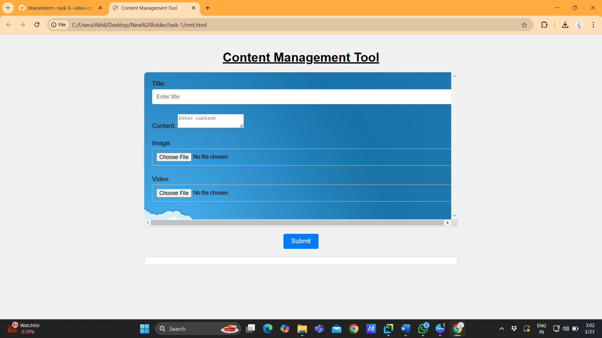

# task--1-content-management-tool
The Content Management Tool (CMT) is an intuitive and user-friendly web application designed for creating and managing blog posts seamlessly. With this tool, users can effortlessly add titles, textual content, images, and videos to design engaging blogs. 
# Content Management Tool

The **Content Management Tool** is a web-based application that allows users to easily create and preview blog posts. Users can add titles, text content, images, and videos, making it a versatile tool for blog creation.

---

## ✨ Features

- **🖋 Add Titles and Content**: Enter a blog title and detailed content.
- **📷 Upload Media**: Add images and videos with real-time previews.
- **⚡ Dynamic Interface**: See your changes instantly as you build the blog post.
- **📱 Responsive Design**: Works across all devices for seamless interaction.

---

## 🛠 Technology Stack

- **HTML**: For structuring the content.
- **CSS**: For styling and making the application visually appealing.
- **JavaScript**: For interactivity and functionality, such as media previews.

---

## 🚀 Installation and Usage

1. **Clone this repository** to your local machine:
   ```bash
   git clone https://github.com/your-username/content-management-tool.git
   ```
2. **Navigate to the project directory**:
   ```bash
   cd content-management-tool
   ```
3. **Open the `cmt.html` file** in any web browser:
   ```bash
   start cmt.html
   ```

---

## 📂 File Structure

```
content-management-tool/
├── cmt.html       # Main HTML file
├── style.css      # CSS file for styles
├── script.js      # JavaScript file for interactivity
```

---

## 🖼 Screenshots

### 🎨 Interface


### 🎥 Media Preview


> Save screenshots in a `screenshots` folder and update the paths accordingly.

---

## 🔮 Future Enhancements

- Integrate a backend system to save and retrieve blog posts.
- Add user authentication for enhanced security.
- Implement a drag-and-drop UI for better customization.

---

## 🤝 Contributing

Contributions are welcome! Follow these steps to contribute:
1. **Fork the repository**.
2. **Create a new branch**:
   ```bash
   git checkout -b feature-name
   ```
3. **Commit your changes** and push to your branch:
   ```bash
   git push origin feature-name
   ```
4. **Open a pull request**.

---

## 📜 License

This project is licensed under the [MIT License](LICENSE).

---

Feel free to suggest improvements or raise issues in the repository.
